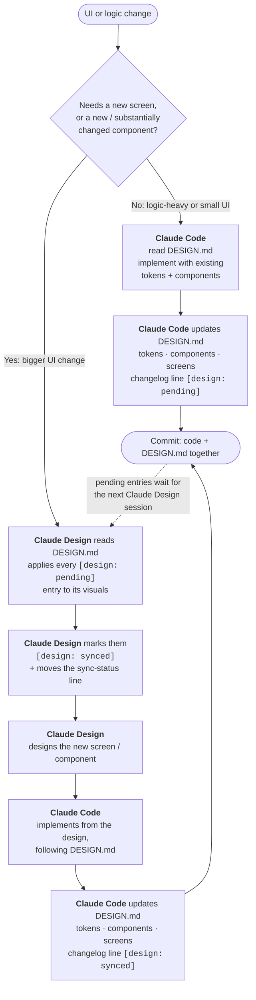

# DESIGN.md — Kacey UI

The single source of truth for the Kacey interface. Everything here comes from the
code as it is. Where the code disagrees with itself, the disagreement is listed in
[§7](#7-inconsistencies-and-debt) and not settled here.

**Before a UI change:** read this file. **After it:** update the tokens, components,
screens and changelog sections in the same commit.

> **Claude Design sync:** synced through `2026-09-25` (Kacey DREAM.dc.html — the night routine's screens) — see [§0](#0-design-implementation-loop). The two `[design: pending]` entries of 2026-09-24 were meant to be applied in that session first; this repo cannot confirm it, so they stay marked pending until the next sync says otherwise.

---

## 0. Design implementation loop

Which tool does the work depends on the size of the UI change.

| Change | Tool | Examples |
|---|---|---|
| Logic-heavy, or a small UI change | **Claude Code** only | New state on an existing component, a new modifier, a copy/spacing fix, wiring a view to data |
| Bigger UI change | **Claude Design** first, then **Claude Code** | A new screen, a redesigned screen, a new or substantially changed component, a layout template change |

- **Small path:** the design falls behind the code on purpose. The `[design: pending]` tag records exactly what's behind.
- **Big path:** Claude Design always catches up on `pending` entries *before* it designs anything new, so it never builds on a stale picture of the app.
- The new work on the big path goes in as `[design: synced]`, because the design already has it.

**Rule of thumb:** if a change can be described with the components in §3, it's small. If it needs a component or layout that isn't there yet, it's bigger.

---

## 1. Overview

| | |
|---|---|
| Framework | None. Vanilla JS, native ES modules, no build step, no dependencies ([ARCHITECTURE.md § Frontend](ARCHITECTURE.md#frontend)) |
| Styling | One hand-written stylesheet, BEM-style class names, CSS custom properties for tokens. No preprocessor, no utility framework |
| Component library | None. A "component" is a CSS block (`.card`, `.btn`, …) plus, for dynamic parts, an `el()` call in the module that renders it |
| Markup | [public/index.html](public/index.html) holds the whole shell: header, every view (hidden until routed to), the sheets, the toast, the tab bar |
| Styles | [public/styles.css](public/styles.css), ordered by section: tokens → base → header → views/layout → cards → controls → chat → lists → journal → calendar → brief → timers → controller → runner/focus → sheets → voiceprint → toast → phone overrides |
| DOM building | [public/js/core/el.js](public/js/core/el.js) — `el('tag#id.class', attrs, children)`. No `innerHTML` anywhere for user/model text |
| Routing | [public/js/ui/router.js](public/js/ui/router.js) — flips `hidden` on `.view[data-view]`, mirrors to `location.hash`. Any `[data-go="view"]` navigates |
| Theme | [public/js/ui/theme.js](public/js/ui/theme.js) — writes one number, `--h`, to `:root`; persisted in localStorage, `?hue=` overrides per load |
| Strings | Chrome strings in [public/js/core/i18n.js](public/js/core/i18n.js) (`cs-CZ`, `en-US`); view copy is hardcoded Czech in HTML/JS (see §7) |
| Theme mode | Dark only (`<meta name="color-scheme" content="dark">`) |

Design principles stated in the stylesheet header: neutral greys, **one** accent,
monospace throughout, **no border radii** (only round status dots), surfaces never
take the hue.

**Out of scope:** [voicelab/public/](voicelab/public/) is a separate dev tool (port
8788) with its own, unrelated palette, sans-serif font and 12px radii. Nothing below
applies to it.

---

## 2. Design tokens

All tokens are defined in `:root` in [public/styles.css:13-44](public/styles.css:13).
Rows marked *(literal)* are values used repeatedly but **not** tokenised yet.

### Colour

| Token | Value | Usage |
|---|---|---|
| `--h` | `193` (set at runtime by theme.js) | The single hue. Presets: 1 RED, 33 AMBER, 150 JADE, 193 CYAN, 225 BLUE, 285 VIOLET |
| `--bg` | `#161616` | Page background, input fields, phone dock |
| `--l1` | `#242424` | Level 1 surface: header, cards, sheets, tab bar |
| `--l2` | `#2f2f2f` | Level 2: buttons, bubbles, tiles, entries, hover rows, "current" row |
| `--l3` | `#3a3a3a` | Level 3: hovered buttons, chips, user bubble, bar tracks |
| `--line` | `#414141` | Default 1px borders and dividers |
| `--line2` | `#565656` | Stronger borders: controls, inputs, sheet box |
| `--ink` | `#f4f4f4` | Primary text |
| `--ink2` | `#c6c6c6` | Secondary text, meta |
| `--ink3` | `#9a9a9a` | Tertiary: timestamps, labels, disabled-looking, past items |
| `--acc` | `hsl(var(--h) 88% 66%)` | The accent: primary buttons, focus ring, "now", pressed states, progress fill |
| `--acc-dim` | `hsl(var(--h) 88% 66% / .16)` | Accent wash: pressed button/switch bg, listening strip, drop target |
| `--on-acc` | `#161616` | Text on an accent fill |
| `--ok` | `#42be65` | Connected, done checkbox, allowed tool, voiceprint hit |
| `--warn` | `#f1c21b` | Mock badge, telemetry warnings, "planned" rows |
| `--err` | `#fa4d56` | Errors, destructive controls, overdue, system bubbles. Fixed — never derived from `--h` |
| `#2e2e2e` *(literal)* | | Row divider inside lists (`.rowbtn`, `.task`, `.tick`, `.cyclestep`, `.readout__row`, `.srow`) |
| `#0b2a14`, `#1d2a20` *(literal)* | | Text on `--ok` fill; done runner item bg |
| `#160203` *(literal)* | | Text on `--err` fill (`.btn--dangerfill`) |
| `#1c1c1c`/`#232323`/`#242424` *(literal)* | | Diagonal hatch for sleep hours (calendar lane, routine grid) |

**Data colours** (JS literals, not tokens):

| Where | Values |
|---|---|
| Routine categories, [routine.js:25-31](public/js/views/routine.js:25) | routine `#d2a106`, gym `#ee5396`, work `#009d9a`, study `#a56eff`, free `#24a148`, commute `#8d8d8d`. Alpha suffix `66` in the grid, `1f` in the calendar lane |
| Calendar sources, [calendar.js:83](public/js/ui/calendar.js:83) | `var(--acc)`, `#78a9ff`, `#08bdba`, `#d2a106`, `#ee5396`, `#a56eff` (assigned by first-seen order) |

### Typography

| Token | Value |
|---|---|
| `--mono` | `"Consolas", "SFMono-Regular", "Menlo", ui-monospace, monospace` — the only family |
| Body | 15px / 1.5, `-webkit-font-smoothing: antialiased` |
| Weights | 400 and 600 only (600 = every "bold") |
| Numbers | `font-variant-numeric: tabular-nums` on every clock, count and time (`.num` helper) |

Size scale in use *(literals, no tokens)*:

| px | Used for |
|---|---|
| 10–11 | Tab labels (10 at ≤360px) |
| 12 | `.label`, `.preset`, tick times, badges, phone header view label |
| 13 | Default small: `.card__title`, `.btn`, meta, `.muted`, `.chip` |
| 14 | Inputs, `.btn--fn`, subheads, sheet/entry body |
| 15 | Body, `.card__title--lg`, `.sheet__title`, row titles, `.btn--lg` |
| 16 | Chat bubble, composer input (never below 16 on phone — iOS zoom) |
| 17 | Current row title, entry `h3`, tile value, journal prose |
| 18–20 | `.briefline` (current 20), `.big`, `.runitem__label` |
| 28–34 | Phone runner title, `.clock--sm` 30, `.clock` 32, done timer 34 |
| 40–64 | `.timercard__big`/`.runner__title` 40, `.focus__title` 44, `.focus__clock` 64 (52 phone) |

Line heights: 1.5 body · 1.6 bubbles, prompt, brief lines, entry text · 1.65 sheet notes · 1.75 journal prose.
Letter-spacing: `.04em` brand/titles-lg, `.06em` card/sheet titles, `.08em` `.label` and phone view label.

### Spacing

| Token | Value | Usage |
|---|---|---|
| `--gap` | `8px` | Gap and padding between every top-level panel (body, `.view`, `.col`, `.dock`), toast offset |

Everything else is literal. Recurring values: **4, 6, 8, 10, 12, 14, 16, 20, 24** px.
Card head/sub/rows use `10px 14px`; sheets use `20px` horizontal; chat log `20px 24px`.

### Radii

None. Everything is square by design. The only exception is `border-radius: 50%` on
status dots (`.conn__dot`, `.btn .dot`).

### Shadows *(literals)*

| Value | Where |
|---|---|
| `0 2px 6px rgb(0 0 0 / .35)` | `.eblock` (calendar event) |
| `0 2px 6px rgb(0 0 0 / .4)` | `.toast` |
| `0 2px 6px rgb(0 0 0 / .5)` | `.sheet__box` |
| `rgb(0 0 0 / .6)` | Sheet backdrop |

### Breakpoints *(literals, in styles.css)*

| Query | Effect |
|---|---|
| `max-width: 1100px` | `.view--triple` drops its left `.col--stack` column |
| `max-width: 760px` | **Phone layout** — its own design (Claude Design "Kacey Mobile"): 52px header naming the view, five-tab bar, cards inset 12px, 44px+ targets, bottom sheets (the `@media (max-width: 760px)` block at the end of [styles.css](public/styles.css)) |
| `min-width: 761px` | Hides `.phone-only` controls on desktop |
| `max-width: 900px and max-height: 460px` | Landscape phone: icon-only tabs, 38px header |
| `max-width: 360px` | Smallest: hides the header's short state, 2-col timer presets |

### Z-index *(literals)*

| Layer | z | Element |
|---|---|---|
| Sticky day column (phone routine grid); event in a lane column | 2 | `.grid__day`, `.eblock--col` |
| Now line | 3 | `.nowline` |
| Sticky dock / inline event editor | 5 | `.dock` (phone), `.eventedit` |
| Sticky column heads (multi-day lane) | 7 | `.colheads` |
| Routine block note editor | 8 | `.noteedit` |
| Sheets (modals); phone scrim | 30 | `.sheet`, `.scrim` |
| Phone bottom sheet | 31 | `.is-psheet-open` |
| Toast | 40 | `.toast` |

### Motion

| Token / value | Where |
|---|---|
| `--motion` = `110ms cubic-bezier(.2, 0, .38, .9)` | Button bg, switch knob. Becomes `1ms linear` under `prefers-reduced-motion` |
| `150ms cubic-bezier(.2, 0, .38, .9)` *(literal)* | `.bar__fill` width |
| `60ms linear` *(literal)* | `.meter__bar` height |
| `900ms linear` *(inline in timers.js)* | Timer countdown bar |
| `@keyframes pulseDot` | Connection dot 2.4s (1.1s when active), talk-button dot 1.2s |
| `@keyframes caret` | Streaming caret, `1s steps(2)` |

Reduced motion also forces every animation to 1ms / 1 iteration, and the orb's
rAF amplitude loop stops ([orb.js](public/js/ui/orb.js)). `body.is-hidden` stops the dot pulse when the tab is hidden.

---

## 3. Components

Each is a CSS block in [public/styles.css](public/styles.css). "JS" names the module that builds it dynamically.
States use `is-*` classes, `aria-pressed`/`aria-current`, or `data-*`.

### Layout

| Component | Purpose | Variants / parts | States | Example |
|---|---|---|---|---|
| `.view` | One routed screen | `--triple`, `--wide`, `--split`, `--full` (see §4); `data-view` | `hidden` | `<section class="view view--wide" data-view="tasks" hidden>` |
| `.col` | Column inside a view | `--stack` (2 rows 1.1/.9), `--stack-auto` (auto/1fr), `--chat` (log/dock), `--rail` (scrolls), `--scroll` | — | `
` |
| `.card` | The panel. `--l1` bg, 1px `--line` border | `--pad`, `--flush`; parts `__head`, `__sub`, `__title` (`--lg`, `--bar`), `__body` (`--scroll`), `__foot` (`--block`) | — | `<section class="card">
<h2 class="card__title">Dnes</h2>
…` |
| `.sheet` | Modal overlay | `--bottom`; `__box` (`--wide` 760, `--xwide` 1080, `--sheetbottom`), `__head`, `__title`, `__close`, `__bar`, `__lede`, `__body`, `__foot`, `__note` | `hidden` | `

` |
| `.runner` / `.focus` | Full-bleed task screens | `runner__head/title/list/add/foot`; `focus__title/clock` | — | `
<h1 class="focus__title">` |
| `.viewbar` / `.embed` | Header row + full-height iframe for a view that frames a separate app (lights) | `.embed__off` (notice card when off or unreachable) | `hidden` | `<iframe class="embed" id="lightsFrame">` |
| `.psheet` + `.scrim` | A panel that sits in the page on desktop and becomes a bottom sheet on a phone ([psheet.js](public/js/ui/psheet.js)): calendar sources, event editor, journal KC chat. `__head` (title + `[data-psheet-close]`) | — | `.is-psheet-open` (phone only has an effect); scrim `hidden` | `openSheet($('calSourcesSheet'))` |
| Helpers | `.row` (flex, gap 8, wraps; `.center`), `.push` (margin-left:auto), `.narrow` (60ch), `.center`, `.sr-only`, `.phone-only` / `.desk-only` (shown on one layout only), `.pairrow` (two equal buttons) | | | `` |

### Navigation

| Component | File | Purpose | States | Example |
|---|---|---|---|---|
| `.top` | index.html | Header: `__brand`, `__mark`, `__name`, `__title` (phone: the view's name, set by router.js), `__stats` (KC version · model · mcp · turns; hidden on a phone), `__badge`, `__end`, `__view` | stats `b.is-ok`/`b.is-bad` | — |
| `.conn` + `#orb` | index.html, [orb.js](public/js/ui/orb.js) | Connection pill / state dot; `__short` is the phone's three-word state (main.js) | `#orb[data-state]` = boot, idle, thinking, speaking, listening, offline, error | — |
| `.tabbar` / `.tab` | index.html, [router.js](public/js/ui/router.js) | Phone bottom nav, 5 tabs (56px), SVG icons 22px stroke 1.6 | `aria-current="true"`, `:active`; hidden >760px and in `task`/`focus` | `<button class="tab" data-go="tasks" data-tab="tasks">` |
| `.btn--fn` in `.fnlist` | index.html | Desktop "Funkce" rail list | first item usually `--accent` | `<button class="btn btn--fn" data-go="journal">Deník</button>` |
| `.btn--back` | index.html | "← Zpět na hlavní" | hidden on phone | `<button class="btn btn--back" data-go="main">` |
| `.link` | styles.css | Inline text action | `:hover` | `<button class="link" data-go="calendar">` |

### Inputs

| Component | Purpose | Variants | States | Example |
|---|---|---|---|---|
| `.btn` | The button | `--sm`, `--lg`, `--block`, `--accent` (primary), `--ghostaccent`, `--outlineaccent`, `--danger`, `--dangerghost`, `--dangerfill`, `--fn`, `--back`, `--step` (36px ±), `--talk` (56px mic) | `:hover` → `--l3`; `:disabled` opacity .45; `aria-pressed="true"` accent border+wash; `.dot` pulses when pressed | `<button class="btn btn--accent btn--sm">Dokončit</button>` |
| `.input` / `.select` | Text field / select | `.prompt` (textarea, 104px), `.prose__area` (journal editor), `--when` (date/time/length: natural width, dark native picker) | `:focus-visible` ring | `<input class="input" type="text">` |
| `.composer` | Chat input bar, 56px (48 phone) | `__input`, `__clip` (attach) | `.is-dropping`; input `.is-interim` (italic, ink3) | — |
| `.chip` / `.chips` | Toggle pill | `--tool` (red/green left bar), `--filter` | `aria-pressed="true"` accent fill | `el('button.chip.chip--filter', { type: 'button', onclick: fn }, m.month)` ([calendar.js](public/js/ui/calendar.js), months-with-events jump) |
| `.seg` / `.seg__opt` | Segmented choice — joined buttons, one pressed | — | `aria-pressed="true"` accent fill | `<button class="seg__opt" data-span="1" aria-pressed="true">Den</button>…` (calendar range) |
| `.tag` / `.tagstrip` | Removable tag chip above the journal text; `__x` remove, `__input` inline add field | — | strip `hidden` when empty | — [journal.js](public/js/views/journal.js) |
| `.switch` | On/off toggle, 48×24 | `__knob` | `aria-pressed`, `:disabled` dashed + hatched knob | `el('button.switch', {'aria-pressed': 'true'}, el('span.switch__knob'))` — [controller.js](public/js/views/controller.js) |
| `.check` | Task checkbox 18px | `--lg` 20px | `aria-pressed="true"` green; overdue red border | — [tasks.js](public/js/views/tasks.js) |
| `.preset` / `.presets` | Hue swatch buttons | `style="--p:<hue>"` | `aria-current="true"` filled | — |
| `.vw__mode` | Segmented choice | — | `aria-pressed` | — |
| `.day` | Month-grid day; press and drag across days selects up to 7 | — | `.has-events`, `.is-past`, `.is-selected` (1-day range), `.is-inrange` (multi-day: accent border + `--acc-dim`), `.is-today`, `aria-pressed` | — [calendar.js](public/js/ui/calendar.js) |
| `.cell` | Routine paint cell | — | `.is-mark`, `.is-asleep`, `.is-sel` | — [routine.js](public/js/views/routine.js) |

### Feedback

| Component | Purpose | States | Example |
|---|---|---|---|
| `.toast` | Bottom-left confirmation, auto-dismiss 3.6s (12s with action). Never for errors | `hidden`; optional `.toast__action` (undo) | `say(label + ' — změnila Kacey.', { label: 'Vrátit zpět', run: fn })` ([store.js:118](public/js/core/store.js:118)) — [toast.js](public/js/ui/toast.js) |
| `.status__alert` | Persistent error strip under chat, `role="alert"` | `hidden` | — [log.js](public/js/ui/log.js) |
| `.status__hint` | Ambient status line | `.is-busy` (accent), `:empty` hidden | — |
| `.listening` | "Poslouchám…" strip | `hidden` | — |
| `.confirm` | Inline destructive confirm (red left bar) | `hidden` | routine "Vymazat vše" |
| `.dirty` | Accent strip "unsaved since open" with an undo button | `hidden` | routine planner "↶ Vrátit" |
| `.bar` / `.bar__fill` | Progress, 6px | `--grow` | `el('span.bar', el('span.bar__fill', {style:'width:40%'}))` |
| `.meter` | 12-bar activity meter driven by orb envelope | — | — |
| `.empty` | Empty-list text | — | `el('p.empty', 'Načítám kalendář…')` |
| `.top__badge` | "mock" badge (warn) | `hidden` | — |

### Data display

| Component | File | Purpose | States |
|---|---|---|---|
| `.msg` / `.msg__bubble` / `.msg__who` | [log.js](public/js/ui/log.js), [journal.js](public/js/views/journal.js) | Chat message; `--user`, `--assistant`, `--system` | bubble `.is-streaming` (caret), `--preamble` (.82 opacity) |
| `.bubbles` | journal.js | Compact chat in a side card | — |
| `.rowbtn` | calendar.js, journal.js | Clickable list row: `__time`, `__title`, `__meta` | `:hover`, `.is-now`, `.is-past` |
| `.nextcard` | index.html, main.js | Main rail's state + "Další na řadě". Phone: `__toggle` folds today's panels open (`__label` "Dnes ▾"/"Skrýt") | view `data-today="open"` |
| `.weekstrip` / `.weekday` | calendar.js | Phone: the week around the range under the folded month; dot = has events | `.is-today`, `.is-inrange`; hidden when view `data-month="open"` |
| `.daypick` / `.daypaint` / `.cell--v` | routine.js | Phone planner: pick a day, paint it as one column of 22px cells, drag down; `.cell__time` gutter, `.cell__name` on a block's first cell, `.noteedit--inline` under it | `.daypick__day[aria-pressed]`, `.cell--v.is-hour` |
| `.task` | tasks.js | Task row: `__text`, `__label`, `__meta` (leads with `__due` — words in the today panel, a dotted-underline button in the full view that opens `.taskwhen`); in `.groups` | `.is-done`, `--overdue` (worked out from `due_at` and the clock), `__due.is-empty` ("+ termín") |
| `.taskwhen` | tasks.js | Due editor under a task row: date, time, length (`.select`, only with a time), `__acts` Uložit · Bez termínu · Zrušit, `__note` | Escape closes |
| `.groups` | tasks.js, index.html | Auto-fit 300px column grid of groups; `--wide` | — |
| `.subhead` | tasks, controller | Group heading with rule | `--err` |
| `.entry` / `.cards` | [library.js](public/js/views/library.js) | Journal entry card: `__head`, `__when`, `__diag`, `__foot` | `.is-unfinished` |
| `.tile` / `.tiles` | [brief.js](public/js/views/brief.js) | Stat tile (`b` label, `strong` value, `em` note) | `em.is-err` |
| `.briefline` | brief.js, morning.js | Spoken brief line (button). `--big` on the morning screen: 22px, `__text` + `__tag` ("teď"/"znovu"), current line washed in `--acc-dim` instead of the left border | `.is-said`, `.is-current` |
| `.timeline` | brief.js | The real night (replaces `.cyclestep`): `__head` (title, `__sum` with `__dot`), `__steps` of `__step` (`__rail` line + `__dot`, `__time`, `__text` b/em), `__act`, `__foot` (sunrise ±15) | `__step[data-st]` = done · ok · warn · err · pend (hollow dot); `.is-last` |
| `.bleedbar` | index.html | Thin state bar of a full-bleed view (morning, proposals): mark, `__name`, `__state` + `__dot`, `__progress` | `__dot[data-st]` = acc · ok · warn · err · pend |
| `.clockbig` | morning.js | 112px clock (60px phone) | — |
| `.checkitem` / `.checkgrid` | morning.js | Morning checklist target, 64px (56 phone): `__box` 30px, `__text` (`__label` 20px, `__sub`), `__go` arrow; `--wide` spans the grid | `.is-done` (acc box + strike), `.is-open` (acc border — "Projít návrhy") |
| `.segbar` | morning.js, proposals.js | Progress as segments, 8px: `__seg`; `--wide` (420px), `--inline` (180px, 72 phone) | `__seg.is-done` acc, `.is-current` ink |
| `.ruletask` | morning.js | Today's rule task: `.check`, `__label`, `__origin`, `__warn` (warn dot), `__when` | `.is-done` |
| `.propcard` / `.propacts` / `.propview` | proposals.js | One proposal: `__name` 42px, `__due`, `__edit` (`__nameinput`, when `.seg`, time), `__why` box, `__facts` (event, confidence); actions 68px (1.5fr/1fr/1fr); `.propview--final` summary with `.propresult` rows | edit mode swaps `#pView`/`#pEdit` |
| `.confbar` | proposals.js | 5-bar confidence, 22×12 | `__bar.is-on` |
| `.ruleset` | rules.js | Rulesets and rules list row: `__text` (b name, em meta/summary), `.switch`, `__go` (phone) | `.is-current` (acc name, `--l2`), `.is-invalid` (warn meta) |
| `.catpick` | rules.js | Routine category picker, 3 cols (2 phone): `__opt` with `__sw` swatch, `--cat` from core/routine-cats.js | `aria-pressed` (2px border in the category colour) |
| `.preview7` | rules.js | Live 7-day preview rows: b when, span task, em reason | `__row.is-muted` (suppressed) |
| `.field` | rules.js | Labelled form field (column); `--inline` (checkbox row) | — |
| `.origin` / `.task__origin` / `.task__why` | tasks.js | Task made by the night: PRAVIDLO (grey) or KACEY (`--kacey`, acc) tag and a "?" (`.origin__why`) that opens the reason under the row (`.task__warn` for the overlap note) | `.origin__why[aria-expanded]` |
| `.injected` | brief.js | Toggleable injected-data row | `aria-pressed` |
| `.monthgrid` | calendar.js | 7-col month | — |
| `.lane` / `.tick` / `.eblock` / `.rblock` / `.sleepband` / `.nowline` / `.allday` / `.legend` | calendar.js | Day timeline: hour ticks, events, routine blocks, sleep hatch | `.eblock.is-short`/`.is-past`, `.rblock.is-short` |
| `.eblock--task` / `.allday--task` / `.colhead__allday--task` + `.eblock__check` | calendar.js | A task in the calendar: dashed, `--l1`, accent left edge, its own 13px checkbox. Timed → lane block `duration` tall; date only → all-day chip. Tap ticks it off | `.is-done` (struck, dimmed), `.eblock--task.is-late` (red edge), `aria-pressed` |
| `.colheads` / `.colhead` / `.lanecols` / `.lanecol` + `.eblock--col` / `.rblock--col` | calendar.js | Multi-day lane (2–7 days): sticky day heads (`__day` button focuses one day, `__meta` count, `__allday` chips), shared hour ruler, one column per day. ≥5 columns drop times/labels | `.colhead__day.is-today` |
| `.eventedit` | calendar.js | Inline rename/delete card over the lane, at the event's top | `--col` (340px, over its column) |
| `.grid` / `.weektotals` / `.wtrow` | routine.js | Routine planner grid (`__row` holds 44px `.cell`s plus `__label` block names, pointer-events none) and week totals | `.grid__day.is-today` |
| `.noteedit` | routine.js | Block note editor, opens under the block, clamped inside the row; saves on Hotovo/Enter/next pick | — |
| `.timercard` / `.presetgrid` / `.savedgrid` / `.customtimer` | [timers.js](public/js/views/timers.js) | Timers | `.timercard.is-done` |
| `.runitem` | tasks.js | Big checklist item in runner | `.is-done` |
| `.readout` | [telemetry.js](public/js/ui/telemetry.js) | `dl` key/value rows | `dd[data-warn]`, `dd[data-bad]` |
| `.srow` | controller.js | Setting row: text, state, switch — or `__step` (− `__value` +) | `__state.is-planned`, `__state.is-on` (ok) |
| `.attach` / `.attachstrip` | [attachments.js](public/js/ui/attachments.js) | Image attachment chip with thumb and × | `:hover` on × |
| `.vw__*` | [wake-panel.js](public/js/voice/wake-panel.js) | Voiceprint sheet: list items, play/delete, score bar, sensitivity | `data-playing`, `data-match`, `data-outlier`, `data-hit` |
| Text helpers | styles.css | `.big` (20 acc), `.strong`, `.muted`, `.muted-3`, `.label`, `.rule`, `.clock` (`--sm`), `.num`, `.is-acc` | — |

---

## 4. Layout patterns

**Shell.** `body` is a flex column with `--gap` padding: `.top` (46px) → `.views` (flex 1) → `.tabbar` (phone only). Body never scrolls; cards scroll inside themselves (`.card__body--scroll`). All views are in the DOM at once; routing flips `hidden`.

**View templates** ([styles.css:143-146](public/styles.css:143)):

| Template | Columns | Used by |
|---|---|---|
| `--triple` | `minmax(230px,.85fr) · minmax(0,1.7fr) · minmax(190px,.55fr)` — context stack · primary · rail | main, journal, calendar, brief |
| `--wide` | `minmax(0,1fr) · minmax(190px,.3fr)` — primary · rail | tasks, library, controller |
| `--split` | `minmax(0,1.7fr) · minmax(230px,.7fr)` | timer |
| `--full` | one column | task (runner), focus |

At ≤1100px `--triple` drops the left stack. At ≤760px every view becomes one scrolling flex column; per-view `order` rules put the primary card first (journal, brief), and the chat view hides its Today/Tasks panels (they have tabs).

**Common compositions**

- **Primary card + rail**: main content in a `.card`, right `.col--rail` with `.btn--back`, a stat `.card--pad`, and a "Funkce" `.fnlist` whose first item is `.btn--accent`.
- **List card**: `.card__head` (title, `.muted` count, `.push` action) → `.card__body--scroll` list → `form.card__foot.row` with `.input` + submit `.btn`.
- **List + detail**: calendar — month grid card beside the day-lane card; selecting a `.day` repaints the lane. Event detail edits inline (`.eventedit`) rather than in a modal.
- **Modal flow**: `.sheet` > `.sheet__box[role=dialog]` with head (title + `.sheet__close.push`), optional `.sheet__bar`s, scrollable `__body`, `__foot` with primary `.btn--accent.push`. Backdrop click and Escape (capture phase) close. Phone: full-screen, except `--sheetbottom`.
- **Destructive confirm**: never a browser `confirm()`. Either an inline `.confirm` strip with `.btn` cancel + `.btn--dangerfill`, or a two-tap `.btn--dangerghost` that relabels to "Opravdu smazat?" for 4s.
- **Forms**: `<form class="… row">`, `.input` flex-grows, submit is the rightmost `.btn` (`--accent` when it's the view's main action).
- **Current-item highlight**: `--l2` bg + 4px `--acc` left border (`.rowbtn.is-now`, `.briefline.is-current`); read from a metre away it is an `--acc-dim` wash instead (`.briefline--big.is-current`).
- **Full-bleed**: `.view--bleed` hides the app header (`body[data-view]`) and puts a 52px `.bleedbar` on top; on a phone the tab bar goes too.

---

## 5. Conventions

**Naming.** BEM-ish: block `.card`, element `.card__head`, modifier `.card--pad`. State: `.is-*` (`is-now`, `is-done`, `is-past`, `is-current`, `is-short`), or ARIA attributes when the state is semantic (`aria-pressed`, `aria-current`, `aria-expanded`). Data flags from telemetry use `data-*`. IDs are camelCase and exist only for JS lookup.

**Files.**
- New markup for a view goes in [public/index.html](public/index.html) inside its `.view` section; dynamic parts are rendered by `el()` in the view module in `public/js/views/`.
- A new panel/widget: module in `public/js/ui/` that looks up its own elements and exports `initX()`, called from [app.js](public/app.js) (see [ARCHITECTURE.md § Adding things](ARCHITECTURE.md#adding-things)).
- Styles go in the matching section of `styles.css`, and any phone override goes in the single `@media (max-width: 760px)` block at the bottom, under a comment for that view.
- New tokens go in `:root`. Never hardcode a colour that a token already covers.

**New component vs. extend.** Add a modifier (`.btn--x`) when it's the same thing with a different emphasis or size. Add a block when the structure differs. Before adding, check §3 — rows, pills and close buttons already have several near-duplicates (§7); reuse one of them rather than adding another.

**Accessibility.**
- Focus: global `:focus-visible` = 2px `--acc` outline, 1px offset. Never remove it without replacing it.
- Everything clickable is a `<button type="button">` (rows, days, cells, briefs), so it gets keyboard focus and the ring.
- Toggles use `aria-pressed`; selection uses `aria-current`; sheet openers use `aria-expanded` + `aria-controls`; sheets are `role="dialog"` with a label.
- Live regions: chat log `role="log" aria-live="polite"`; errors `role="alert"`; toast `role="status"`; `#announcer` for finished turns.
- Icon-only buttons need `aria-label` (and `title`); decorative SVGs/dots get `aria-hidden="true"`.
- Hide things with the `hidden` attribute — `[hidden]{display:none!important}` makes it win over component `display`.
- Contrast: text sits on `--bg`/`--l1`/`--l2`; `--ink3` is the lowest text tone. Danger is always `--err`, never the accent.
- Respect `prefers-reduced-motion` (handled by `--motion` and the global override; JS animation must check `dom.reduceMotion`).

**Responsive.** Desktop first, then a phone design at ≤760px that is its own layout, not a squeeze (Claude Design "Kacey Mobile"):
- 52px header with the view's name and a short state; tab bar replaces the rail and back buttons; `task`/`focus` hide it.
- Views pad 12px with 12px between cards; chat and calendar run flush.
- The same DOM is re-ordered, not duplicated: `order` plus `display: contents` on a column (or card) lets its children join the view's order. Anything pulled up that way gets `flex: 0 0 auto`, or it collapses.
- Controls that only one layout needs are `.phone-only` / `.desk-only`, wired by the same handler (e.g. `[data-dictate]`, `[data-task-act]`).
- Side panels become bottom sheets via `.psheet` + [psheet.js](public/js/ui/psheet.js); modal `.sheet`s slide up 70px short of the top.
- Heights use `dvh`, safe-area insets pad the header/tab bar/sheets, touch targets ≥44px, inputs ≥16px.

---

## 6. Screens inventory

| Route (`#hash`) | Template | Markup | Logic | Components |
|---|---|---|---|---|
| `main` | triple | [index.html:58](public/index.html:58) | [views/main.js](public/js/views/main.js), [ui/log.js](public/js/ui/log.js), [ui/attachments.js](public/js/ui/attachments.js) | card, rowbtn (agenda), task, msg, composer, attach, btn--talk, status strips, big/muted, fnlist |
| `tasks` | wide | [index.html](public/index.html) `data-view="tasks"` | [views/tasks.js](public/js/views/tasks.js), [core/due.js](public/js/core/due.js) | card, groups (Po termínu · Dnes · Tento týden, then Později · Bez termínu · Hotové dřív when not empty), subhead, task, taskwhen, check, bar, input--when (add form: label, date, time), fnlist, btn--back |
| `journal` | triple | [index.html:176](public/index.html:176) | [views/journal.js](public/js/views/journal.js) | clock, bubbles/msg, tagstrip/tag, prose__area, btn .dot, fnlist |
| `library` | wide | [index.html:228](public/index.html:228) | [views/library.js](public/js/views/library.js) | card__sub input, chips/chip--filter, cards/entry |
| `calendar` | triple | [index.html](public/index.html) `data-view="calendar"` | [ui/calendar.js](public/js/ui/calendar.js) | monthgrid/day (drag range), seg (Den · 3 dny · Po–Pá · Týden), ‹ › range step, legend/swatch, lane/tick/eblock/rblock/sleepband/nowline/allday, eblock--task/allday--task (tasks with a due date; "úkoly" in Zdroje), colheads/lanecols (multi-day), eventedit, chip--filter month jump, fnlist |
| `brief` | triple | [index.html](public/index.html) `data-view="brief"` | [views/brief.js](public/js/views/brief.js), [views/lineplayer.js](public/js/views/lineplayer.js) | tiles/tile, brieflines/briefline, timeline (the real night + sunrise ±15), injected, prompt, bar |
| `morning` | bleed | [index.html](public/index.html) `data-view="morning"` | [views/morning.js](public/js/views/morning.js) | bleedbar, clockbig, briefline--big, segbar, checkgrid/checkitem, ruletask, morningdone |
| `proposals` | bleed | [index.html](public/index.html) `data-view="proposals"` | [views/proposals.js](public/js/views/proposals.js) | bleedbar, segbar--inline, propcard, confbar, seg (when), propacts, propview--final/propresult |
| `rules` | rules (3 cols; phone: one pane by `data-step`) | [index.html](public/index.html) `data-view="rules"` | [views/rules.js](public/js/views/rules.js) | ruleset + switch, field, seg--fill, tagstrip--field/tag, catpick, ruleitems, preview7, btn--danger (two-tap) |
| `lights` | full | [index.html](public/index.html) `data-view="lights"` | [views/lights.js](public/js/views/lights.js) | viewbar, embed (iframe of lightsd on this host :8080), embed__off (switched off in controller / lightsd unreachable), link |
| `timer` | split | [index.html:363](public/index.html:363) | [views/timers.js](public/js/views/timers.js) | label, presetgrid, customtimer, btn--step, clock--sm, savedgrid, timercard, bar |
| `controller` | wide | [index.html:402](public/index.html:402) | [views/controller.js](public/js/views/controller.js), [ui/telemetry.js](public/js/ui/telemetry.js), [ui/theme.js](public/js/ui/theme.js), [ui/voice-picker.js](public/js/ui/voice-picker.js) | groups--wide, subhead, srow/switch, srow__step ("Noc a ráno"), readout ("Stav noci"), select, meter, chip--tool, presets |
| `task` | full | [index.html:502](public/index.html:502) | [views/tasks.js](public/js/views/tasks.js) | runner, runitem, bar |
| `focus` | full | [index.html:526](public/index.html:526) | [views/tasks.js](public/js/views/tasks.js) | focus, label, btn--lg |
| Sheet: Víc (phone) | sheet--bottom | [index.html](public/index.html) `#moreSheet` | [ui/router.js](public/js/ui/router.js) | fnlist (56px; Ranní brief accent · Knihovna · Světla · Časovače · Controller) |
| Phone sheets | psheet | calendar `#calSourcesSheet`, `.eventedit`, journal `#jChatCard` | [ui/psheet.js](public/js/ui/psheet.js) | psheet__head, scrim |
| Sheet: routine planner | sheet xwide | [index.html](public/index.html) `#routinePanel` | [views/routine.js](public/js/views/routine.js) | sheet__bar, chips (brushes), revert btn, dirty, confirm, btn--step, grid/cell/grid__label, noteedit, weektotals/wtrow |
| Sheet: voiceprint | sheet wide | [index.html:657](public/index.html:657) | [voice/wake-panel.js](public/js/voice/wake-panel.js) | vw__* |
| Toast | global | [index.html:709](public/index.html:709) | [ui/toast.js](public/js/ui/toast.js) | toast |

---

## 7. Inconsistencies and debt

**Hardcoded values that should be tokens**
- `#2e2e2e` row divider (7 uses, now also `.lanecol`) sits between `--l1` and `--l2` with no token.
- `#3a3a3a` in `.cell.is-mark` duplicates `--l3`.
- On-colour literals `#0b2a14` (×2), `#1d2a20`, `#160203`; `.link:hover` uses `#fff` (not `--ink`).
- Sleep hatch colours `#1c1c1c`/`#232323`/`#242424`, defined twice with different stripe widths (6px lane, 4px grid).
- No font-size, spacing (beyond `--gap`), shadow, z-index or breakpoint tokens. 18 distinct font sizes.
- Three shadow alphas (.35/.4/.5) for the same `0 2px 6px` shadow.
- `.bar__fill` repeats `--motion`'s easing with 150ms instead of using a token.
- Routine category colours ([routine.js:25](public/js/views/routine.js:25)) and calendar source colours ([calendar.js:83](public/js/ui/calendar.js:83)) are separate JS palettes that share three hexes (`#d2a106`, `#ee5396`, `#a56eff`), so a source and a category can look identical.
- `<meta name="theme-color">` is `#161616` in HTML but theme.js rewrites it to `hsl(h 62% 3%)`, which is neither `--bg` nor `--l1`.

**Inline styles in JS that bypass CSS**
- Positions computed per item stay inline by necessity (`top`/`height` of lane blocks, `left`/`width` of `.grid__label` and `.noteedit`, `left` of `.eventedit--col`); only geometry, never colour tokens — except category/source colours, which are data (§2).
- journal.js marks the current session with inline `border-color`/`color: var(--acc)` instead of a state class.
- library.js empty state uses inline `grid-column:1/-1;padding:28px` on `.entry`.
- timers.js sets bar colour and a `900ms linear` transition inline.
- controller.js uses inline `display:contents` wrapper.

**Dead or orphaned**
- theme.js looks up `#hueRing`, `#hueKnob`, `#hueValue`, `#settingsPanel`, `#settings`, `#settingsClose` — none exist in index.html (the hue dial sheet is gone; presets live in the controller). `?openSettings=1` does nothing.
- `--amp` (orb.js) and `--lvl` (wake-panel.js) are written every frame but no CSS reads them, so the voiceprint level bar `.vw__level` never fills.
- Classes set but unstyled: `.msg--preamble`, `.miczone__note`, `.btn--x` (only styled inside `.timercard .row`).
- Many `…[hidden] { display:none }` rules are redundant with the global `[hidden]` rule.

**Duplicate / near-duplicate components**
- "Current item" highlight is implemented twice with different state names: `.rowbtn.is-now`, `.briefline.is-current` (`.cyclestep` is gone, replaced by `.timeline`).
- Two state-dot implementations: `.bleedbar__dot` / `.timeline__dot` (share `[data-st]` colours) and `.conn__dot` (orb-driven).
- The rules editor's `summary()` and the server's `describeRule()` say the same words in two places (the server one is Node-only: zod, crypto).
- Controller's `NIGHT_DEFAULTS` mirrors `config.js` by hand.
- Pill-like buttons: `.chip`, `.chip--filter`, `.allday`, `.vw__mode`, `.preset` all differ slightly in padding and border.
- Close/remove buttons: `.sheet__close`, `.toast__x`, `.attach__x`, `.vw__del`, `.tag__x` — five variants.
- Segmented choices: `.seg__opt` (calendar range) and `.vw__mode` (voiceprint) do the same job with different sizes.
- Two "tertiary delete" styles: `.btn--dangerghost` and `.vw__del`.
- List rows with bottom divider: `.rowbtn`, `.task`, `.cyclestep`, `.srow`, `.readout__row` each re-declare padding + `#2e2e2e` border.

**Phone**
- The phone design's brief player has an icon-only ↺ restart and puts the clock under the bar; the app keeps "Od začátku" and wraps the row.
- The phone routine planner keeps the desktop's bar order (brushes, revert, clear) rather than the design's footer row of Vymazat vše · Vrátit · Hotovo.
- `.nextcard__toggle` is a real button on desktop too, where it toggles an attribute nothing reads.

**Accessibility gaps**
- `.composer__input` sets `outline: none` and `.composer` has no `:focus-within` style, so the main text field shows no focus indicator.
- The "Víc" sheet has no Escape handler (routine, voiceprint and the old settings sheet do).
- Voiceprint sheet is `aria-modal="false"`; the other two are `true`.

**Language**
- `html lang="cs"` and view copy is hardcoded Czech in HTML/JS; only chrome strings go through i18n.js, so switching to English leaves most of the UI Czech.
- Some static HTML is English regardless of language: `aria-label="Conversation"`, `"Start talking"`, "Controller", readout keys (STATE, MODEL…), view label "main", "Idle", "Connecting…".

**Separate design system**
- voicelab/public/ uses its own tokens (`--panel`, `--accent: #5eead4`, `--radius: 12px`, Segoe UI), contradicting "monospace, no radii". Fine for a dev tool, but it is not the Kacey design.

---

## 8. Changelog

One line per feature that changes the UI. Newest first. Format: `YYYY-MM-DD — what changed (tokens / components / screens touched) [design: pending|synced]`.
`pending` means Claude Design hasn't picked the change up yet; see [§0](#0-design-implementation-loop).

- 2026-09-25 — Implemented Claude Design "Kacey DREAM" (the night routine, docs/DREAM.md P6): new full-bleed views **morning** (1a–1e: `.bleedbar`, `.clockbig`, `.briefline--big`, `.segbar`, `.checkitem`, `.ruletask`, `.morningdone`) and **proposals** (2a, 2b, 2d: `.propcard`, `.confbar`, `.propacts`, `.propview--final`); new view **rules** (3a–3h: `.ruleset`, `.field`, `.catpick`, `.preview7`, phone panes by `data-step`); Brief's cycle card replaced by the real night `.timeline` (4a–4f) with sunrise ±15 moving lightsd's morning routine; task rows get `.origin` PRAVIDLO/KACEY + "?" reason (5a, placed under the meta line so it never squeezes the label); Controller gets "Noc a ráno" `.srow`s (switch and `.srow__step`) and a "Stav noci" readout (5b); night dim `html.is-night` (5c, the dim layer only — the minimal night layout is not built); Funkce rail and Víc gain Ráno and Pravidla. Not built: 2c (the "make it a rule" offer — P7). `.cyclestep` removed. [design: synced]
- 2026-09-24 — **KC 1.0.0**, the first release ([CHANGELOG.md](CHANGELOG.md)). Header stats lead with the release (`KC 1.0.0`, from the server's `ready` frame). [design: pending]
- 2026-09-24 — Tasks are due by timestamp, not by a stored group: `due_at` is a date or a date + time (+ `duration`), and the groups are worked out from it and the clock ([core/due.js](public/js/core/due.js)). Task rows lead with the due date (`.task__due`, opens `.taskwhen`); the add form gets date and time fields (`.input--when`; on a phone they share the second line with Přidat); new groups Později, Bez termínu, Hotové dřív. Timed tasks are drawn in the calendar lane and dated ones in the all-day strip (`.eblock--task`, `.allday--task`, `.eblock__check`), with "úkoly" as a switchable source in Zdroje; "Další na řadě" counts timed tasks. [design: pending]
- 2026-09-24 — Implemented Claude Design "Kacey Mobile" (phone ≤760px): header names the view + short state (`.top__title`, `.conn__short`); chat gets a folding "Další na řadě" (`.nextcard`) and a full-width talk button under the composer; calendar folds the month into its name, adds `.weekstrip`, week/3-day stepping, Zdroje and the event editor as bottom sheets (`.psheet`, `.scrim`, new [psheet.js](public/js/ui/psheet.js)), 3-option range; tasks get a summary card with the list controls and a docked add field, groups as cards; journal dictates from the top card, KC chat as a sheet, 2×2 actions; library search-first; brief/timers/controller re-ordered into cards; routine planner paints one day as a vertical column (`.daypick`, `.daypaint`, `.cell--v`); sheets slide up 70px short of the top. Timer empty-state copy no longer says "vlevo". [design: synced]
- 2026-09-24 — Implemented Claude Design "Kacey Redesign": new **Lights** screen (frames the separate lightsd app, `viewbar`/`embed`, "Světla" in Funkce and Víc); calendar **multi-day range** (drag across month days, `.seg` Den/3 dny/Po–Pá/Týden, ‹ › step, `.colheads`/`.lanecols`, `.day.is-inrange`, month-jump label); routine planner **revert to state at open** (`.dirty` strip + button), block labels on the grid (`.grid__label`, cells 44px), inline `.noteedit` replacing the note bar, lede/footer copy removed; journal **tag chips** (`.tagstrip`/`.tag`, inline field instead of `prompt()`); controller lights row live, music row planned; `.eventedit` moved into CSS. [design: synced]
- 2026-09-24 — DESIGN.md created from the code as of `e5859e3`. No UI changes. [design: synced]
